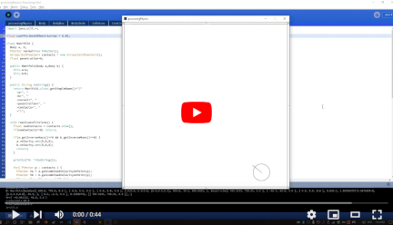

# processingPhysics

Physics in Processing.  

Read more here: https://www.marginallyclever.com/2021/11/friday-facts-7-a-2d-physics-engine-in-processing-java-and-the-sunk-cost-fallacy/

## usage

Select different demos from the drop-down list.
Press 'g' to toggle gravity.
Press 'f' to pause/unpause.  Press spacebar while paused to step once.
mouse wheel click + drag: move camera
mouse wheel roll: zoom camera
mouse left + drag: create rubber band between cursor and body at start of action.
mouse right + drag: create impulse force the moment button is released.

## join us!

Make it even better.  We welcome your input.  Join the conversation at https://discord.gg/Q5TZFmB

## video

## requirements

Processing from http://www.processing.org

Requires ControlP5 library, which can be installed from within the app.  Sketch > Import Library > Add Library > seach "ControlP5".

## Much inspiration and help from

- https://www.youtube.com/watch?v=SHinxAhv1ZE
- https://www.cs.ubc.ca/~rhodin/2020_2021_CPSC_427/lectures/D_CollisionTutorial.pdf
- godot engine https://github.com/godotengine/godot
- ImpulseEngine https://github.com/RandyGaul/ImpulseEngine
